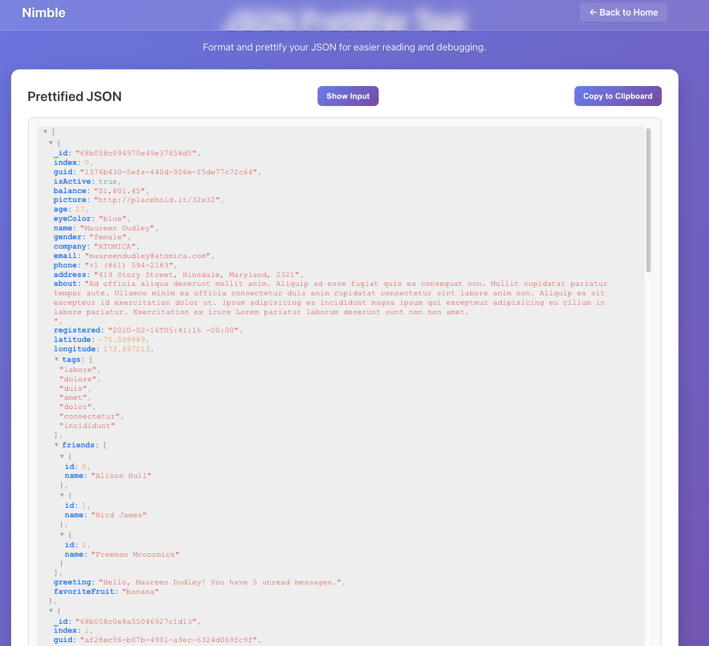

# Nimble

I needed a set of tools to carry out some tasks that I could trust. For example, if I want to prettyfy some json that contains sensitive information, I do not want to send that json to some online formatter that I have no control of. Instead I built this which is running on my local machine in docker ensuring I have the tools I need to help me day to day that without compromising on data security.

This app is designed for functionality over aesthetics - simple tools that get the job done efficiently. I am also not a react developer :D 

## What is Nimble?

Nimble is a toolkit of straightforward utilities that help with common data processing tasks. It's not meant to be beautiful or showcase-worthy, but rather to be a reliable set of tools you can count on when you need to quickly transform or filter data.

## Available Tools

### CSV Substitution Tool
Transform CSV data using pattern substitution with numbered placeholders like `{0}`, `{1}`, `{2}`, etc. Perfect for quickly reformatting data or creating SQL queries from CSV files.

### Line Removal Tool
Remove lines from text that contain specific IDs. Useful for filtering scripts, log files, or any text data where you need to exclude entries based on a list of identifiers.

### JSON Prettyfier
Format a json string and display it in a readable way, allowing for easy inspection of json objects.




## Getting Started

### Prerequisites
- Node.js (version 14 or higher)
- npm

### Installation
1. Clone the repository
2. Install dependencies:
   ```bash
   npm install
   ```

### Running the App
```bash
npm start
```
Open [http://localhost:3000](http://localhost:3000) to view it in the browser.

## Development

### Available Scripts

- `npm start` - Runs the app in development mode
- `npm test` - Launches the test runner
- `npm run build` - Builds the app for production
- `npm run eject` - Ejects from Create React App (one-way operation)

## Philosophy

This app follows a "function over form" approach:
- **Simple and direct**: No unnecessary complexity
- **Fast and reliable**: Tools that work when you need them
- **Practical focus**: Each tool solves a real, common problem
- **Minimal UI**: Clean interfaces that don't get in the way

## Contributing

Feel free to add new tools that follow the same philosophy - simple, practical utilities that solve common data processing problems.

## Built With

- [React](https://reactjs.org/) - Frontend framework
- [Create React App](https://github.com/facebook/create-react-app) - Build tool
- [React Router](https://reactrouter.com/) - Navigation
